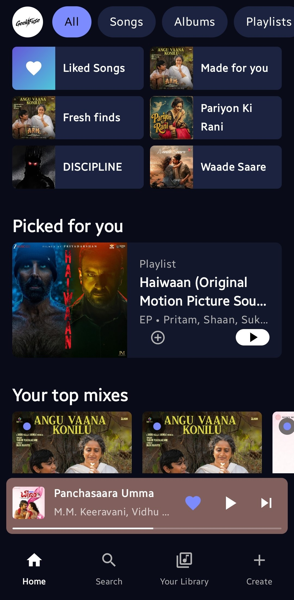
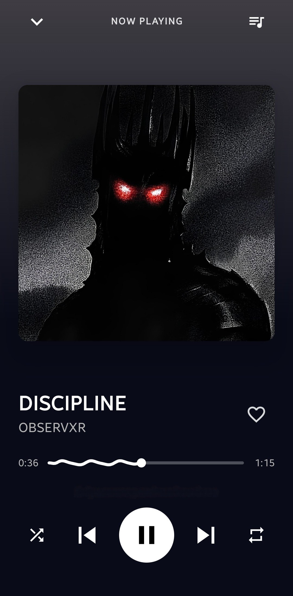
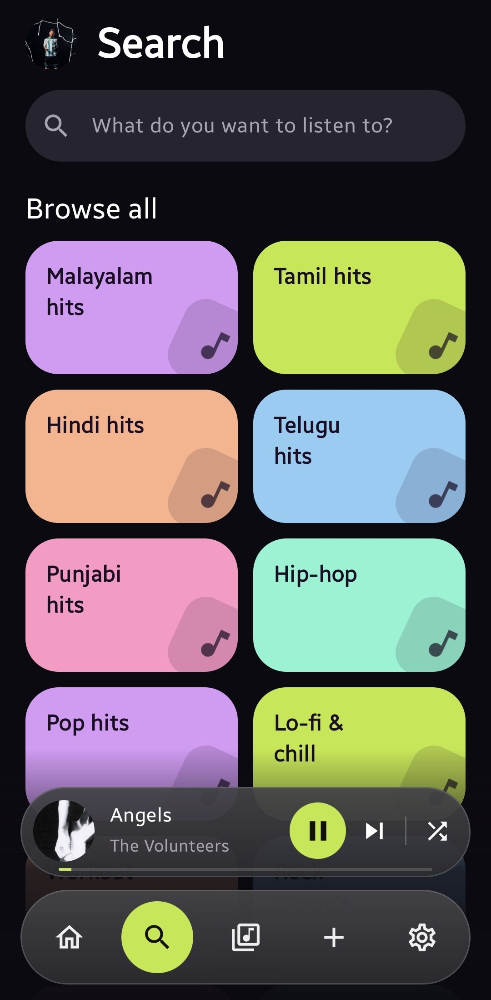
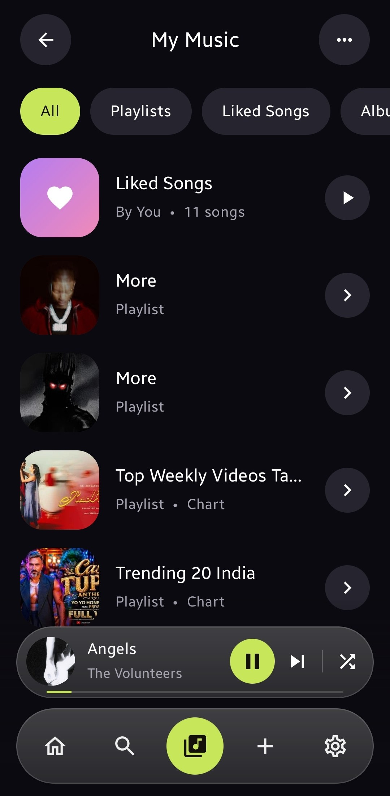

# Geekify

<a href="https://github.com/Amal-kphilip/Geekify-App/releases/latest"></a>
<a href="https://github.com/Amal-kphilip/Geekify-App/releases/latest/download/Geekify-latest.apk"></a>

**Geekify** is a native Android music player built with Kotlin and Jetpack Compose. Discover music, search songs, build a personal library, and keep listening with background playback and notification controls.

> Geekify is an independent personal and educational project. It is not affiliated with YouTube, YouTube Music, Spotify, or their respective owners.

## Screenshots

<p align="center">
  
  
  
  
</p>

## Features

- Search songs, albums, artists, and playlists.
- Browse genre and language collections, including Malayalam, Tamil, Hindi, Telugu, and Punjabi music.
- Background playback with a MediaSession notification and lock-screen controls.
- Persistent queue, shuffle, repeat, seeking, and a full now-playing screen.
- Liked songs, custom playlists, and recents stored locally in Room.
- Add any searchable track to Liked Songs or a playlist.
- Personal mixes based on recent plays, likes, artists, and detected language preference.
- Optional Firebase account sync with email/password or Google sign-in.
- In-app extractor health checks to help diagnose playback issues.

## Tech stack

| Area | Technology |
| --- | --- |
| Language and UI | Kotlin, Jetpack Compose, Material 3 |
| Playback | Media3, ExoPlayer, MediaSessionService |
| Music data | YouTube Music InnerTube, OkHttp, Kotlin Serialization |
| Storage | Room, DataStore |
| Images | Coil |
| Accounts and sync | Firebase Authentication, Cloud Firestore, Credential Manager |
| Build and CI | Gradle, GitHub Actions |

## Run locally

### Prerequisites

- Android Studio with JDK 17
- Android SDK 26 or newer
- An Android device or emulator

### Steps

1. Clone the repository.

   ```bash
   git clone https://github.com/Amal-kphilip/Geekify-App.git
   cd Geekify-App
   ```

2. Open the project in Android Studio and let Gradle sync.

3. Build a debug APK.

   ```bash
   ./gradlew :app:assembleDebug
   ```

   The APK is written to `app/build/outputs/apk/debug/app-debug.apk`.

4. Optional: configure Firebase for account sync.

   - Create or open a Firebase project.
   - Add Android app ID `com.geekify.android` and download `google-services.json` into `app/`.
   - Enable Email/Password and Google providers in Firebase Authentication.
   - Create Firestore and deploy rules that restrict each `users/{uid}` document to its owner.
   - Register debug and release SHA-1 fingerprints for Google sign-in.

Guest mode works without Firebase; likes and playlists still stay on the device.

## Tests

```bash
./gradlew testDebugUnitTest
./gradlew :app:compileDebugKotlin
```

Before opening a playback-related pull request, test play/pause, next/previous, screen-off playback, notification controls, a slow network, and app restart on a real device.

## Contributing

Contributions are welcome—bug fixes, accessibility improvements, test coverage, documentation, and UI polish are all useful.

1. Open an issue for substantial changes so the direction can be agreed first.
2. Fork the repository and create a focused branch.
3. Make the change, add or update tests where practical, and run the checks above.
4. Open a pull request with a concise description, screenshots for UI changes, and reproduction and verification steps.

Please do not commit credentials, keystores, `google-services.json`, generated build files, or downloaded media.

## Roadmap

- [ ] Improve device and network playback-resilience tests.
- [ ] Add automated lint, unit-test, and release checks on pull requests.
- [ ] Add Firebase Crashlytics and release-health monitoring.
- [ ] Improve offline-friendly queue and metadata caching.
- [ ] Expand accessibility coverage and large-screen layouts.
- [ ] Improve language-aware recommendations when metadata uses Latin script.
- [ ] Add contributor issue templates and `good first issue` tasks.

## Open issues

Browse or create work items in the [issue tracker](https://github.com/Amal-kphilip/Geekify-App/issues). Useful reports include the device/Android version, app version, exact reproduction steps, expected behavior, actual behavior, and relevant screenshots or logs.

## Releases

Tagged releases are built by GitHub Actions and publish a signed APK to [GitHub Releases](https://github.com/Amal-kphilip/Geekify-App/releases). Release signing values belong in GitHub Actions secrets; never commit them.

## Project notes

Audio URLs are resolved directly on the device and can change as upstream services evolve. If playback fails, use Geekify's Health screen first, include its message in a GitHub issue, and avoid sharing account credentials or private tokens.

## License and terms

Geekify is licensed under the [Apache License 2.0](LICENSE). Directly accessing music streams may be subject to the upstream service's terms. Use the app responsibly and ensure that any distribution complies with applicable policies and rights.
